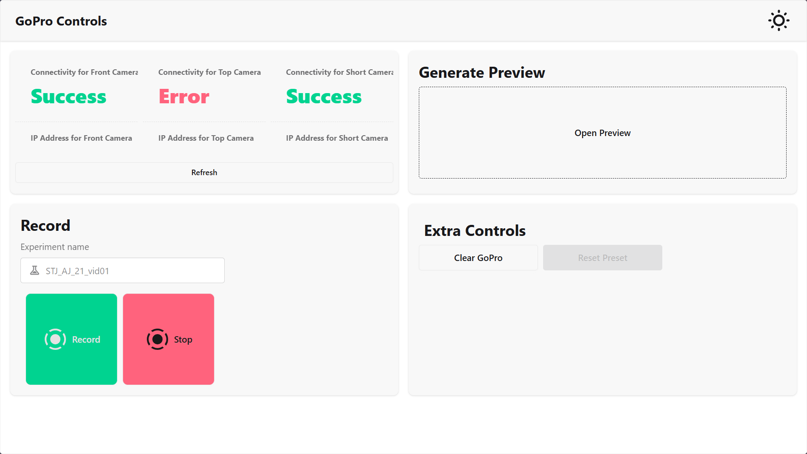

# Go Pro Web UI

## Usage
First clone the repository.
```bash
git clone "https://github.com/MrRyanPerson/GoPro-webui.git"

cd "GoPro-webui"
```
### Depedencies
```bash
# Restart terminal after running
winget install -e --id OpenJS.NodeJS

# Should return version of node and npm
node -v
npm -v
```
### Backend
Enter the backend Directory
```bash
cd ./backend
```
Now, create a venv and activate it
```
python -m venv .venv

./.venv/Scripts/Activate
```
Install the dependencies:
```bash
pip install -r requirements.txt
```
Run the app.
```
python main.py
```
### Front End
In a new terminal CD to the root directory of the project and then run
```bash
# Build Project
npm run build

PORT=80 node build
```
## Development
### 5/20/2026
* Started Project
* Initialized Project Structure and Svelte Project + Fastapi backend
### 5/21/2026
* Finalized UI for app
* Created Mock Backend.
### 5/22/2026
* Finished Backend.
## Wiki
[Link To Wiki](https://github.com/MrRyanPerson/GoPro-webui/wiki)
